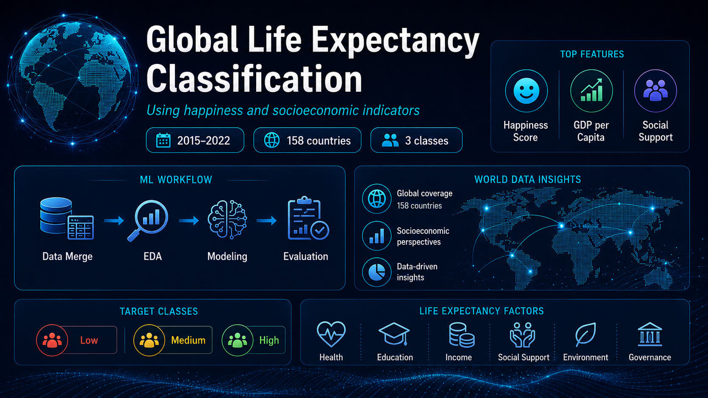
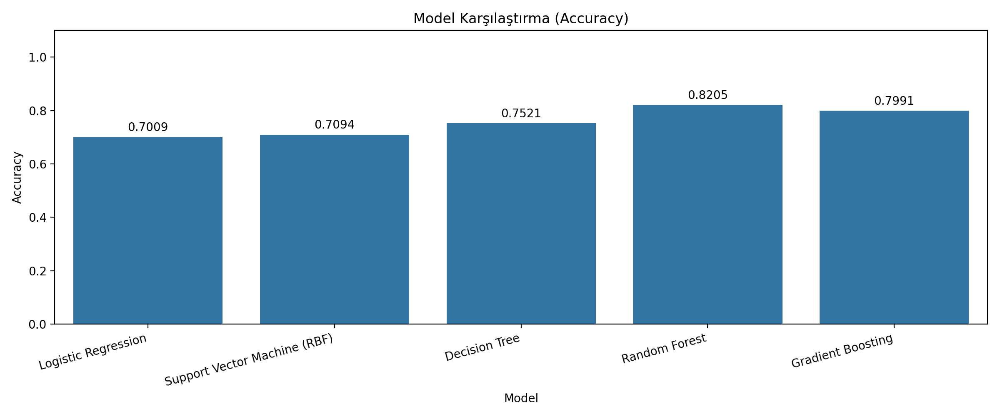
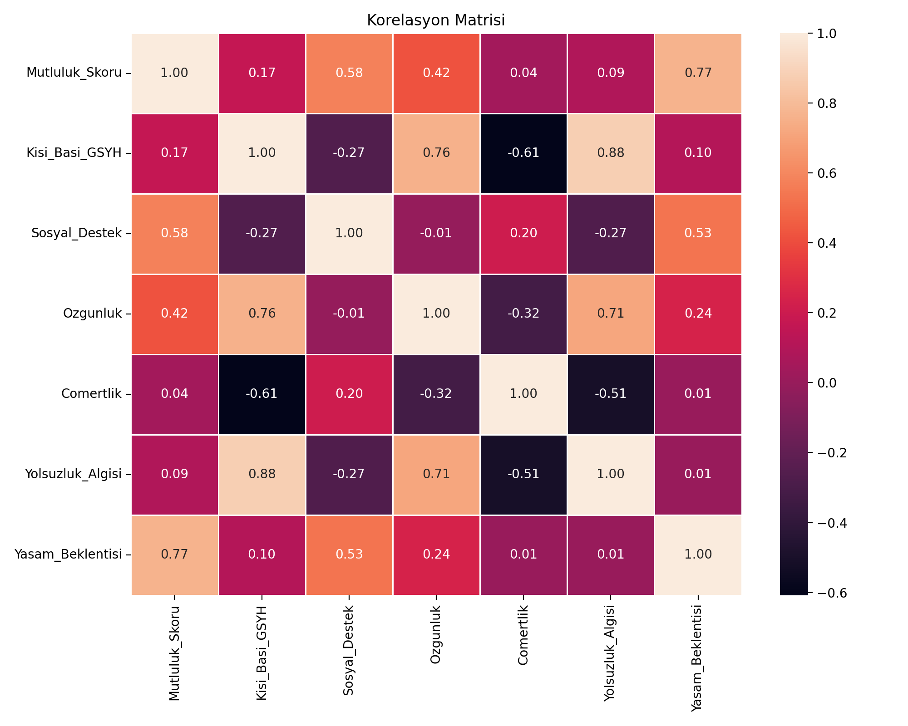
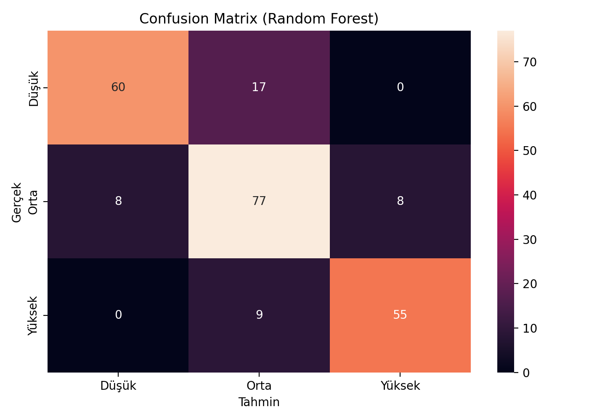
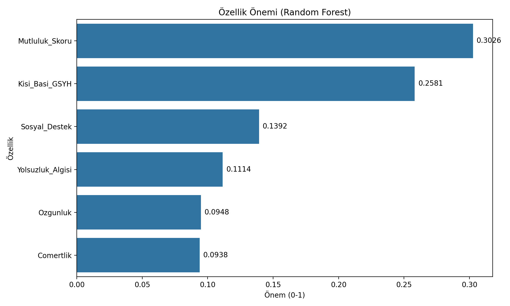

# Global-life-expectancy-classification
<p align="center">
  
</p>

<p align="center">
  
  
  
  
  
</p>

## Proje Hakkında

Bu projede, ülkelerin mutluluk ve sosyoekonomik göstergeleri kullanılarak yaşam beklentisi düzeylerinin sınıflandırılması amaçlanmıştır.

2015–2022 yılları arasındaki Dünya Mutluluk Raporları ile Dünya Bankası yaşam beklentisi verileri birleştirilmiştir. Veri temizleme, ülke adlarının standartlaştırılması, keşifsel veri analizi ve ön işleme adımlarının ardından farklı denetimli makine öğrenmesi algoritmaları eğitilmiş ve karşılaştırılmıştır.

Yaşam beklentisi değişkeni üç sınıfa ayrılmıştır:

- Düşük yaşam beklentisi
- Orta yaşam beklentisi
- Yüksek yaşam beklentisi

---

## Araştırma Sorusu

**Mutluluk ve sosyoekonomik göstergeler kullanılarak ülkelerin yaşam beklentisi düzeyleri sınıflandırılabilir mi?**

---

## Veri Seti

Projede iki temel veri kaynağı kullanılmıştır:

- 2015–2022 yıllarına ait Dünya Mutluluk Raporları
- Dünya Bankası yaşam beklentisi verileri

Veri setleri ülke ve yıl bilgileri kullanılarak birleştirilmiştir.

### Veri Seti Özeti

| Özellik | Değer |
|---|---:|
| Zaman aralığı | 2015–2022 |
| Ülke sayısı | 158 |
| Gözlem sayısı | 1.170 |
| Hedef sınıf sayısı | 3 |

### Kullanılan Değişkenler

| Değişken | Açıklama |
|---|---|
| Mutluluk Skoru | Ülke düzeyindeki mutluluk puanı |
| Kişi Başına GSYH | Ekonomik gelişmişlik göstergesi |
| Sosyal Destek | Algılanan sosyal destek düzeyi |
| Özgürlük | Bireylerin yaşam tercihlerini yapabilme özgürlüğü |
| Cömertlik | Ülke düzeyindeki cömertlik göstergesi |
| Yolsuzluk Algısı | Algılanan yolsuzluk düzeyi |
| Yaşam Beklentisi | Hedef sınıfların oluşturulmasında kullanılan sağlık göstergesi |

---

## Yaşam Beklentisi Sınıfları

| Sınıf | Tanım |
|---|---|
| Düşük | 70 yılın altı |
| Orta | 70–78 yıl arası |
| Yüksek | 78 yılın üzeri |

---

## Proje İş Akışı

1. Yıllık veri setlerinin toplanması
2. Ülke adlarının standartlaştırılması
3. Veri setlerinin birleştirilmesi
4. Eksik verilerin incelenmesi
5. Keşifsel veri analizi
6. IQR yöntemiyle aykırı değer analizi
7. Değişkenlerin ön işlenmesi
8. Eğitim ve test verilerinin ayrılması
9. Modellerin eğitilmesi
10. Çapraz doğrulama
11. Hiperparametre optimizasyonu
12. Model değerlendirmesi
13. Özellik önemi analizi

---

## Kullanılan Makine Öğrenmesi Modelleri

Aşağıdaki sınıflandırma algoritmaları değerlendirilmiştir:

- Lojistik Regresyon
- RBF çekirdekli Destek Vektör Makineleri
- Karar Ağacı
- Random Forest
- Gradient Boosting

Model performansları şu metriklerle değerlendirilmiştir:

- Test doğruluğu
- Ağırlıklı F1-skoru
- Tabakalı 10 katlı çapraz doğrulama
- Karmaşıklık matrisi

---

## Bulgular

Model karşılaştırması sonucunda, topluluk tabanlı ağaç yöntemlerinin diğer sınıflandırma yaklaşımlarından daha başarılı olduğu görülmüştür.

| Model | Test Doğruluğu | Ağırlıklı F1-Skoru | Ortalama Çapraz Doğrulama |
|---|---:|---:|---:|
| Lojistik Regresyon | 0.7009 | 0.7022 | 0.7282 |
| Destek Vektör Makineleri | 0.7094 | 0.7100 | 0.7479 |
| Karar Ağacı | 0.7521 | 0.7509 | 0.7726 |
| **Random Forest** | **0.8205** | **0.8215** | **0.8436** |
| Gradient Boosting | 0.7991 | 0.8005 | 0.8111 |

En yüksek genel sınıflandırma performansı Random Forest modeli ile elde edilmiştir.

Modelde en etkili değişkenler sırasıyla:

1. Mutluluk skoru
2. Kişi başına GSYH
3. Sosyal destek
4. Yolsuzluk algısı
5. Özgürlük
6. Cömertlik

olarak belirlenmiştir.

---

## Görselleştirmeler

### Model Karşılaştırması

<p align="center">
  
</p>

### Korelasyon Matrisi

<p align="center">
  
</p>

### Karmaşıklık Matrisi

<p align="center">
  
</p>

### Özellik Önemi

<p align="center">
  
</p>

---

## Proje Dosya Yapısı

```text
Global-life-expectancy-classification/
├── Data/
│   ├── 2015.csv
│   ├── 2016.csv
│   ├── 2017.csv
│   ├── 2018.csv
│   ├── 2019.csv
│   ├── 2020.csv
│   ├── 2021.csv
│   ├── 2022.csv
│   └── dunyabankasi.csv
│
├── outputs/
│   ├── grafik_confusion_matrix.png
│   ├── grafik_korelasyon_matrisi.png
│   ├── grafik_model_karsilastirma.png
│   ├── grafik_ozellik_onemi.png
│   ├── hist_Kisi_Basi_GSYH.png
│   ├── hist_Mutluluk_Skoru.png
│   ├── hist_Yasam_Beklentisi.png
│   ├── model_sonuclari.csv
│   ├── outlier_ozet_iqr.csv
│   └── gridsearch_best.txt
│
├── LICENSE
├── Life_Expectancy_Analysis-Report.pdf
├── README.md
├── Resim1.png
├── life_expectancy_analysis.py
└── proje_veri_seti.csv
```

---

## Kurulum

Projeyi bilgisayarınıza klonlayın:

```bash
git clone https://github.com/Haticeikkan/Global-life-expectancy-classification.git
cd Global-life-expectancy-classification
```

Sanal ortam oluşturun:

```bash
python -m venv .venv
```

Windows üzerinde sanal ortamı etkinleştirin:

```bash
.venv\Scripts\activate
```

Gerekli Python kütüphanelerini yükleyin:

```bash
pip install pandas numpy matplotlib seaborn scikit-learn
```

---

## Projenin Çalıştırılması

Ana proje klasöründe aşağıdaki komutu çalıştırın:

```bash
python life_expectancy_analysis.py
```

Oluşturulan grafikler, model sonuçları ve özet tablolar `outputs` klasörüne kaydedilir.

Birleştirilmiş veri seti ise şu dosyada saklanır:

```text
proje_veri_seti.csv
```

---

## Oluşturulan Çıktılar

Analiz sonucunda aşağıdaki çıktılar oluşturulmaktadır:

- Temizlenmiş ve birleştirilmiş veri seti
- Tanımlayıcı istatistikler
- Dağılım grafikleri
- Kutu grafikleri
- IQR tabanlı aykırı değer özeti
- Korelasyon matrisi
- Model karşılaştırma sonuçları
- Hiperparametre optimizasyon sonuçları
- Karmaşıklık matrisi
- Özellik önemi analizi

---

## Proje Raporu

Projenin ayrıntılı raporuna aşağıdaki bağlantıdan ulaşılabilir:

[Proje raporunu görüntüle](Life_Expectancy_Analysis-Report.pdf)

---

## Kullanılan Teknolojiler

- Python
- pandas
- NumPy
- Matplotlib
- Seaborn
- scikit-learn

---

## Sınırlılıklar

- Analiz ülke düzeyindeki gözlemsel verilere dayanmaktadır.
- Bulgular nedensel ilişki olarak yorumlanmamalıdır.
- Ülkeler ve yıllar arasında farklı raporlama standartları bulunabilir.
- Ülke ortalamaları bireysel sağlık sonuçlarını temsil etmez.
- Aynı ülkeler birden fazla yılda yer aldığı için gözlemler tamamen bağımsız olmayabilir.
- Ülke bazlı gruplandırılmış doğrulama, daha temkinli bir performans tahmini sağlayabilir.

---

## Gelecek Geliştirmeler

Projenin ilerleyen aşamalarında şu geliştirmeler yapılabilir:

- Ülke bazlı grup çapraz doğrulama
- Zaman duyarlı model doğrulama
- Regresyon tabanlı yaşam beklentisi tahmini
- Sağlık harcamaları ve eğitim göstergelerinin eklenmesi
- SHAP tabanlı model açıklanabilirliği
- Etkileşimli veri görselleştirmeleri
- Otomatik veri toplama ve ön işleme
- Modelin web uygulaması olarak sunulması

---

## Yazar

**Hatice İkkan**

Bilgisayar Mühendisliği Yüksek Lisans Öğrencisi

- GitHub: [Haticeikkan](https://github.com/Haticeikkan)
- LinkedIn: [Hatice İkkan](https://www.linkedin.com/in/Haticeikkan/)

---

## Lisans

Bu proje MIT Lisansı ile lisanslanmıştır. Ayrıntılar için [LICENSE](LICENSE) dosyasına bakabilirsiniz.
